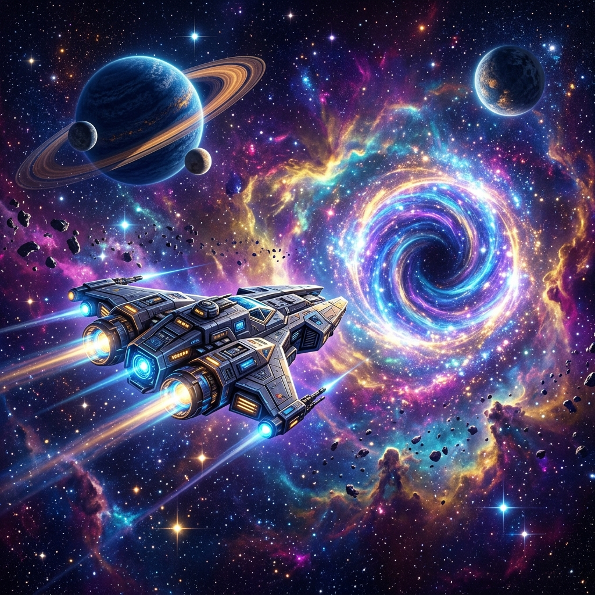

# 🌌 AppInfinity Galaxy — A Nova Geração

Bem-vindo ao **AppInfinity Galaxy**, uma experiência arcade espacial definitiva, revitalizada com um design premium, gameplay expandido e performance otimizada.

## 🚀 O que há de novo?

Nesta versão mais recente, transformamos o coração do jogo com adições significativas:

* **Revitalização Visual**: Interface moderna com estética *glassmorphism*, gradientes vibrantes e micro-animações fluidas.
* **Expansão de Gameplay**:
  * **Drones**: Novos aliados robóticos para suporte em combate.
  * **Inimigos Inteligentes**: Patrões e naves inimigas com padrões de ataque desafiadores.
  * **Buracos Negros**: Obstáculos gravitacionais perigosos e dinâmicos.
* **Sistema de Combate**: Melhoria na detecção de colisão, novos disparos e power-ups balanceados.
* **Infraestrutura**: Sistema de autenticação (Supabase/OAuth) totalmente corrigido e estabilizado.
* **Estabilidade e Evolução**:
  * **Correção de Tipagem**: Sistema de upgrades robusto e livre de erros.
  * **Sincronização de Dados**: Integração total com o banco de dados Supabase para persistência de progresso.
* **Design Responsivo**: Controles mobile aprimorados e interface adaptável.

## 🎮 Como Jogar

1. **Acesse o link local**: `http://localhost:8080`
2. **Autenticação**: Faça login via Google ou utilize o modo convidado.
3. **Controles**:
    * `Mouse` para movimentar.
    * `Click` para disparar.
    * `Touch` (em dispositivos móveis) para navegação completa.

## 🛠️ Tecnologias Utilizadas

* **Core**: React + TypeScript + Vite.
* **Styling**: Tailwind CSS + Shadcn UI.
* **Backend**: Supabase (Auth & Database).
* **Animação**: Framer Motion & CSS Animado.

---
Desenvolvido com foco em alta performance e experiência do usuário. 🌟
